<h1>Marcus Vinícius Augusto Rocha</h1>
<h2> Introdução </h2>

Olá! Sou o Marcus, nasci em Caçapava e tenho 22 anos. Estudei meus dois últimos anos do ensino médio na escola SESI 207, de Caçapava, o que me possibilitou aos 18 anos iniciar o curso técnico de mecânica no SENAI de Taubaté-SP. Ainda sem muita noção de qual área queria seguir, pretendia fazer uma faculdade de engenharia mecânica para complementar meus conhecimentos adquiridos no ensino técnico. Durante o curso, aprendi várias coisas, dentre as quais, desenho técnico foi minha matéria favorita, mas não me sentia bem com a ideia de ver tudo aquilo mais a fundo na faculdade. Ao final dos dois anos de curso, não iniciei imediatamente na faculdade, então fiquei 6 meses parado, sem estudar ou trabalhar. Foi então que, em Julho de 2020, um amigo me mandou mensagem informando-me que havia uma faculdade com processo seletivo aberto e que a classificação aconteceria através do histórico escolar. Tratava-se da FATEC. Fiz uma pesquisa sobre os cursos disponíveis, fiz minha inscrição e acabei passando para o curso que havia escolhido, Análise e Desenvolvimento de Sistemas. Logo no início dos estudos me identifiquei muito com o curso, não tinha conhecimento prévio nenhum sobre a área e tudo o que aprendia parecia super interessante. Com o início do API (Aprendizagem por Projeto Integrador), montamos os grupos, e o integrante com mais conhecimento nos dividiu entre desenvolvedores backend e frontend. Acabei ficando com a área de frontend, onde também me identifiquei muito e decidi seguir na função nos semestres seguintes para melhorar cada vez mais minhas habilidades e meus conhecimentos. Graças a isso, consegui meu primeiro emprego na maior empresa de saúde do mundo, a Johnson & Johnson, onde já pude atuar como desenvolvedor frontend em vários sites das marcas, como Listerine, Neostrata, Neutrogena, Tylenol, Johnson’s Baby, entre outros, e, atualmente, atuo como desenvolvedor full-stack no Janssen Pro, uma plataforma criada para os profissionais da área da saúde.
Fora do ambiente estudantil e profissional, meus interesses são mais voltados para músicas, filmes e séries. Sou bem caseiro, mas gosto de sair pra tomar um café, ou comer algo com os amigos.

<h3> Principais Conhecimentos </h3>

<b>JavaScript</b>

Em 2020 tive meu primeiro contato com a linguagem, através da necessiade gerada durante a execução do primeiro projeto de API na FATEC.
A cada semestre, foquei em melhorar minhas habilidades com o front-end, o que me permitiu conquistar um trabalho nessa área e me desenvolver cada vez mais.
Hoje também possuo conhecimento em alguns frameworks como Bootstrap, Vue JS e React JS.

---
---

<h2>Sumário</h2>
<h3><a href="#user-content-projeto-1-e-commerce-"><b>Projeto 1: E-commerce</b></a></h3>
<h3><a href="#user-content-projeto-2-dashboard-"><b>Projeto 2: Dashboard</b></a></h3>
<h3><a href="#user-content-projeto-3-crm-"><b>Projeto 3: CRM</b></a></h3>
<h3><a href="#user-content-projeto-4-subiter-"><b>Projeto 4: ERP</b></a></h3>
<h3><a href="#user-content-p5"><b>Projeto 5: Data Transfer</b></a></h3>
<h3><a href="#user-content-projeto-6-geoforesight-"><b>Projeto 6: GeoForesight</b></a></h3>

---
---

<h2 id="projeto1" align="center"><b><a href="https://github.com/RoyaltyDev/Projeto_integrador_2020-2" target="_blank" style="color: inherit; cursor:pointer;">Projeto 1: E-commerce</a> 🔗</b></h2>

Projeto Integrador - 1° Semestre | Fatec Prof. Jessen Vidal - 2020 | Cliente interno: Profº Antônio Egydio São Thiago Graça

<h3><b> Visão do Projeto </b></h3>

O objetivo do projeto consistiu em realizar a criação de um e-commerce para venda de materiais didáticos, também criado pelos alunos, mas com foco em introduzir os alunos ao método ágil utilizando o Scrum e às tecnologias utilizadas durante a criação de um projeto web.

IMAGENS DO SISTEMA

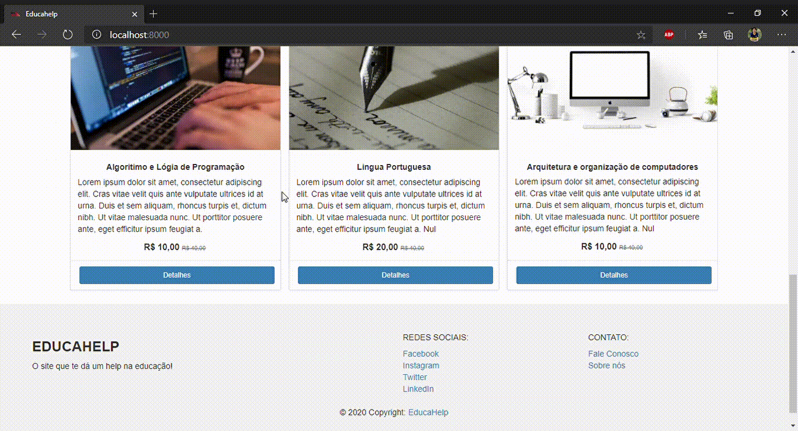
<figcaption style="font-size: smaller;">Homepage

<figcaption style="font-size: smaller;">Parte inferior da homepage - Conteúdos e rodapé

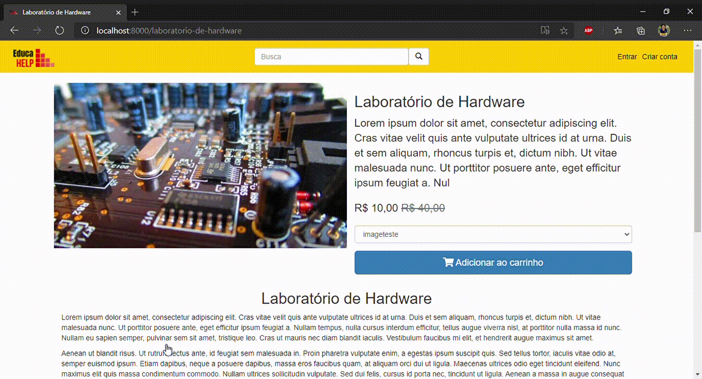
<figcaption style="font-size: smaller;">Página de conteúdo específico

<h3><b> Tecnologias utilizadas </b></h3>

- <b>Python:</b> Linguagem na qual foi desenvolvida o back-end.
- <b>Figma:</b> Plataforma utilizada para criar os wireframes do sistema.
- <b>HTML:</b> Linguagem de marcação através da qual foi construída a estrutura das páginas.
- <b>CSS:</b> Utilizado para estilizar as páginas e seus elementos.
- <b>Bootstrap:</b> Utilizado para auxiliar no desenvolvimento do front-end de forma mais facilitada.

<h3><b> Contribuições pessoais </b></h3>

Iniciei o projeto focado na parte do front-end, onde participei ativamente na elaboração do design no figma e da criação das telas através de:
- Estruturação das páginas com HTML
  - Durante esse projeto, tive meu primeiro contato com o desenvolvimento web, e criar o HTML foi o meu primeiro desafio. Por meio de pesquisas, fui começando a entender levemente o que era necessário, não somente para estruturar a página, mas o HTML como um todo em suas configurações. 
  Ao longo do projeto criei nossa homepage, tela do produto, carrinho de compras e a página com informações do time responsável pela plataforma. 
- Estilização do sistema com CSS e Bootstrap
  - Depois de criar a base das páginas no HTML, foi a hora de começar a desenvolver a parte do estilo. Por também não conhecer a linguagem, em algumas pesquisas encontrei o bootstrap. Esse framework me auxiliou muito na criação de componentes como cards, banners e botões. Ainda assim, para chegar mais próximo do nosso wireframe, precisei utilizar um pouco do CSS puro para conseguir modificar e refinar alguns detalhes pontuais.

<h3 align="center">APRENDIZADOS EFETIVOS</h3>

<h3>Hard Skills</h3>

<h4><b> Figma ★★★★☆</b></h4>

Figma é uma ferramenta muito utilizada em projetos de sistemas web para a construção de wireframes, que são protótipos não funcionais que serviram de base para a validação e desenvolvimento do produto final. Nele criei os designs das telas necessárias para o nosso sistema, tal como login, homepage, carrinho e página do produto.

<h4><b> HTML ★★★☆☆</b></h4>

HTML é a linguagem de marcação que utilizei no desenvolvimento web para criação do conteúdo das páginas. Lá defini os campos, textos e imagens em cada tela, estruturando tudo conforme necessário.

<h4><b> CSS e bootstrap ★★☆☆☆</b></h4>

CSS é a linguagem de estilização responsável por dar forma ao nosso conteúdo, trazendo cores e posicionamentos adequados a cada elemento. Por não possuir nenhum conhecimento prévio de estilizações no primeiro semestre, me apoiei no uso do bootstrap, um dos frameworks mais conhecidos para realizar a estilização de componentes. Através da adição de algumas classes específicas no HTML, já é possível obter um visual completo para determinada situação.

<h4>Linguagem de Marcação ★★☆☆☆</h4>
Logo no início do projeto tive meu primeiro contato com o HTML e compreendi que haviam outros tipos de linguagem, além das de programação. Utilizando essa linguagem para estruturar nossas páginas, busquei saber mais sobre como a linguagem funcionava, como deveria ser estruturada, o que era indispensável e quais tags deveria utilizar para cada coisa.

<h4>Linguagem de Estilização ★★☆☆☆</h4>
Em conjunto com o HTML, busquei conhecimento também sobre o CSS utilizado para dar vida ao sistema e comodidade ao usuário. Entendi que um sistema limpo dá mais conforto ao usuário e o mantém por mais tempo utilizando nosso sistema

<h4>Frameworks ★★☆☆☆</h4>
O Bootstrap foi o principal framework utilizado por mim durante o trabalho no projeto. Por não ter nenhum conhecimento prévio de como criar uma página web, o Bootstrap serviu de grande auxílio por possuir designs prontos, que são facilmente acessados por meio de classes no HTML.

<h3>Soft Skills</h3>

<h4>Metodologia Ágil ★★★★☆</h4>
O início do trabalho com o método Scrum facilitou a organização e desenvolvimento do projeto. Através deste método, foi mais fácil compreender os requisitos e traçar o plano de como iria ser entregue.

<h4>Trabalho em equipe ★★★★☆</h4>
Trabalhar em equipe como em uma empresa me deu uma visão muito mais próxima da realidade da nossa área. Aprendi como me organizar melhor durante as divisões de tarefas e como me comunicar melhor também com os membros do time.

---

<h2 id="projeto2" align="center"><b><a href="https://github.com/Time-1-ADS/ProjetoGSW" style="color: inherit; cursor: pointer;">Projeto 2: Dashboard</a> 🔗</b></h2>

Projeto Integrador - 2° Semestre | Fatec Prof. Jessen Vidal - 2021 | Cliente parceiro: GSW

<h3><b> Visão do Projeto </b></h3>

O projeto teve como objetivo realizar a criação de um dashboard, que consumiria dados de fontes diferentes, sendo elas Jira e Trello, para facilitar a visualização das métricas empresariais

IMAGENS DO SISTEMA

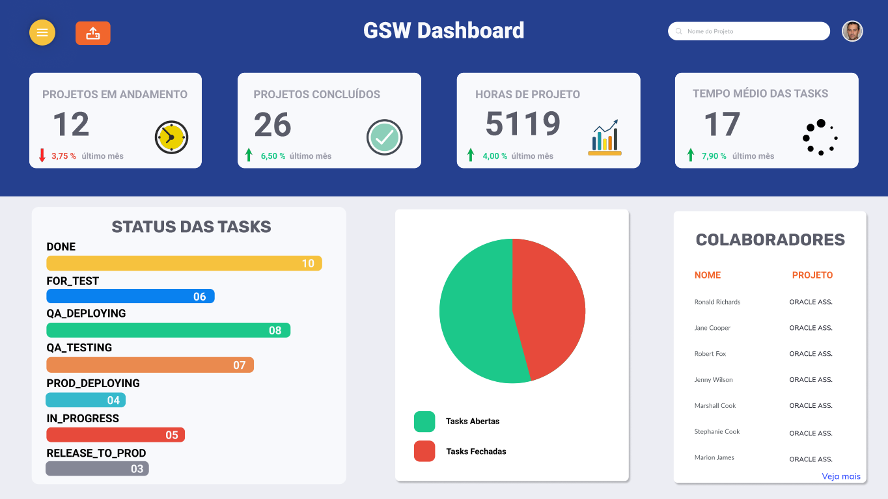
<figcaption style="font-size: smaller;">Homepage

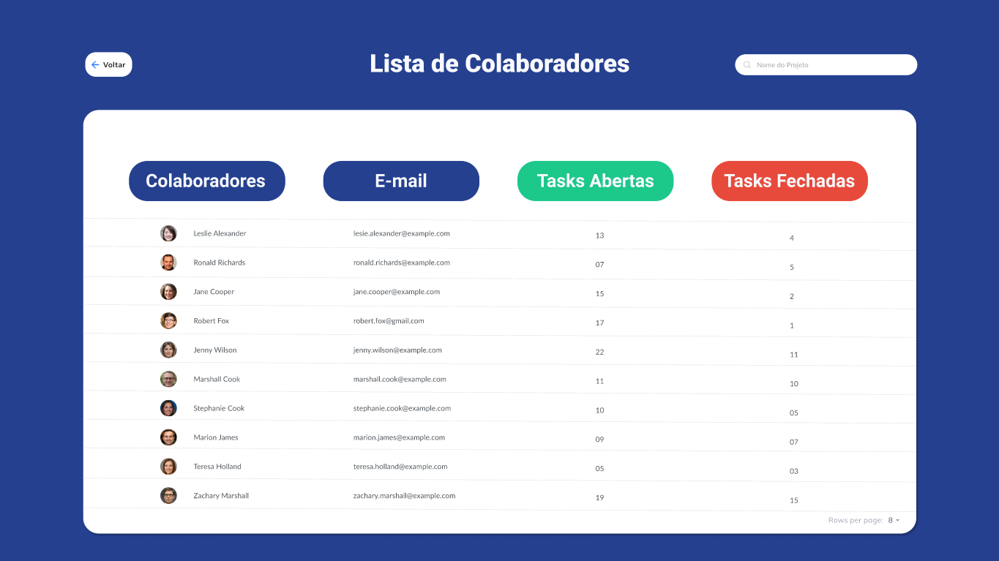
<figcaption style="font-size: smaller;">Tela de colaboradores

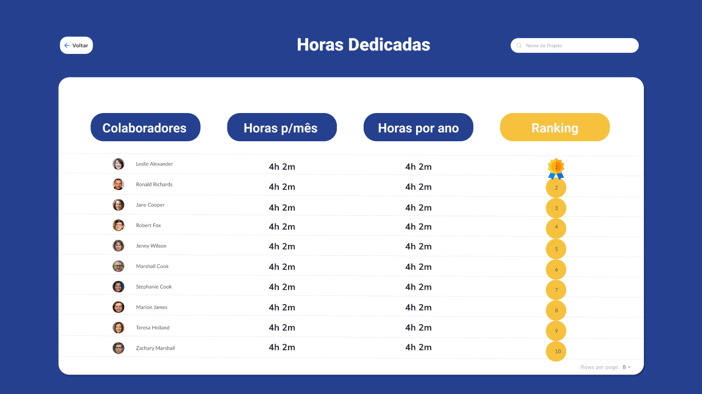
<figcaption style="font-size: smaller;">Ranking de tasks fechadas

<h3><b> Tecnologias utilizadas </b></h3>

- <b>Python: </b>Linguagem de programação utilizada para tratar os dados e aplicar um padrão no qual a aplicação foi configurada para aceitar.
- <b>Django: </b> Framework web, no qual o projeto foi feito.
- <b>Figma: </b> Plataforma utilizada para criar o wireframe do sistema.
- <b>HTML: </b> Linguagem de marcação na qual foi criada a estrutura das páginas.
- <b>CSS: </b> Utilizado para fazer a estilização necessária em cada elemento.
- <b>Bootstrap: </b> Biblioteca CSS utilizada para criar mais facilmente alguns componentes da aplicação.
- <b>Javascript: </b> Utilizado para recolher os dados vindos do back-end e mostrá-los ao usuário.
- <b>Charts JS: </b> Biblioteca utilizada para a geração de gráficos do dashboard.

<h3><b> Contribuições pessoais </b></h3>

Ao longo do projeto auxiliei tanto os desenvolvedores da parte do front-end quanto do back-end:
- Auxílio na criação e estilização das páginas
  - Realizei a criação de todas as páginas do nosso sistema. Na homepage, fiz a inserção dos gráficos, identificados por títulos e legendas, para facilitar a visualização das informações recebidas e tratadas previamente com o python. Também possuia uma tela de colaboradores, informando quantas tasks cada um havia trabalhado, por quantas horas, e o email de cada um. Por fim, nossa terceira tela era um hanking de melhores funcionários, de acordo com o fechamento de tasks e horas gastas.
- Auxílio no tratamento dos dados e padronização com python
  - Também trabalhei no tratamento das informações, buscando entender como seria possível padronizar os diferentes formatos de informações recebidas, juntando o json fornecido pelo Jira e pelo Trello em um só formato.
- Registro dos dados e criação dos gráficos interativos
  - A criação dos gráficos foi o foco principal do projeto, e através do JavaScript, consegui recolher as informações vindas do backend, e colocá-las na tela, permitindo ao usuário uma visualização bem mais facilitada dos dados.

<h3 align="center"><b> APRENDIZADOS EFETIVOS </b></h3>

<h3>Hard Skills</h3>

<h4><b> Python ★★★☆☆</b></h4>

Durante esse projeto, o Python se fez útil para o tratamento das informações recebidas. A empresa parceira me disponibilizou dois arquivos do tipo json para serem carregados no nosso sistema. Através do python, fiz o mapeamento do formato dos dois arquivos, tratando e unindo todas as informações em um único formato padrão recinhecido pelo nosso sistema.

<h4><b> HTML, CSS e Bootstrap ★★★☆☆</b></h4>

Para esse projeto, continuei utilizando as mesmas tecnologias para a criação da base e estilização dos conteúdos, porém com um controle maior da estilização, uma vez que já possuia uma noção melhor do funcionamento das tecnologias, visto que já havia utilizado cada uma delas no semestre anterior.

<h4><b> JavaScript e Charts JS ★★☆☆☆</b></h4>

Por estar focado na parte do front-end, fez-se necessário o uso de uma nova linguagem de programação para dar mais interatividade ao sistema e torna-lo mais atrativo ao usuário. Através do JavaScript e com o auxílio da biblioteca Charts JS, gerei gráficos com os valores enviados pelo back-end e que dariam sentido ao nosso sistema, validando a entrega.

<h4>Bibliotecas ★★★☆☆</h4>
O uso de bibliotecas foi algo novo nesse semestre. Com essa tecnologia não precisei criar tudo do zero. Para cada objetivo tive acesso a diversas bibliotecas, onde foi preciso apenas importá-las e seguir a documentação de como usá-las.
A biblioteca utilizada foi o Charts JS para composição dos gráficos interativos, que foram foco do nosso projeto.

<h3>Soft Skills</h3>

<h4>Trabalho em equipe ★★★☆☆</h4>
Atuando nas duas frentes do projeto, sendo o front-end e o back-end, acabei desenvolvendo melhor minha forma de trabalhar em equipe. Ao fornecer auxílio, precisei aprimorar meu lado empático e procurar entender as dificuldades de cada um, para que pudesse ajudar da melhor forma e assim conseguirmos finalizar as tarefas dentro do prazo estipulado.

<h4>Gestão de tempo ★★★☆☆</h4>
Além de prestar auxílio aos meus colegas também fiz minhas próprias tasks, o que me forçou de modo positivo a gerir melhor meu tempo. Separava horários específicos em que estaria livre para ajudar e que estaria focado no que eu havia me comprometido em entregar. 

---
---

<h2 id="projeto3" align="center"><b><a href="https://github.com/Time-1-ADS/PROJETO-NESS" style="color: inherit; cursor: pointer;">Projeto 3: CRM</a> 🔗</b></h2>

Projeto Integrador - 3° Semestre | Fatec Prof. Jessen Vidal - 2021 | Cliente parceiro: NESS

<h3><b> Visão do Projeto </b></h3>

Esse projeto teve como objetivo realizar a criação de um CRM (Custom Relationship Management) para controlar o relacionamento da empresa com seus clientes e, desta forma, registrar informações com os dados de contatos dos clientes, quantidade de chamados abertos e serviços prestados.

IMAGENS DO SISTEMA

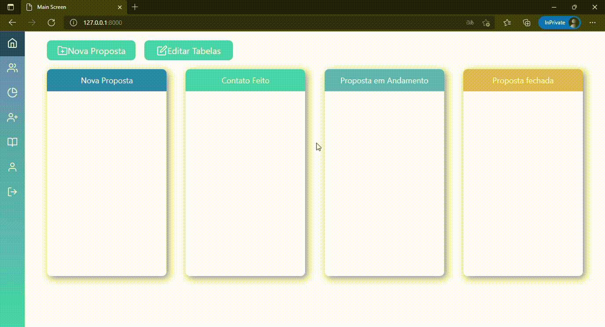
<figcaption style="font-size: smaller;">Homepage

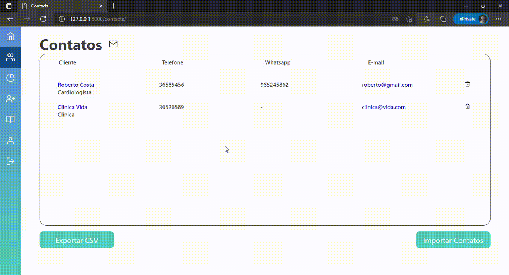
<figcaption style="font-size: smaller;">Tela de contatos

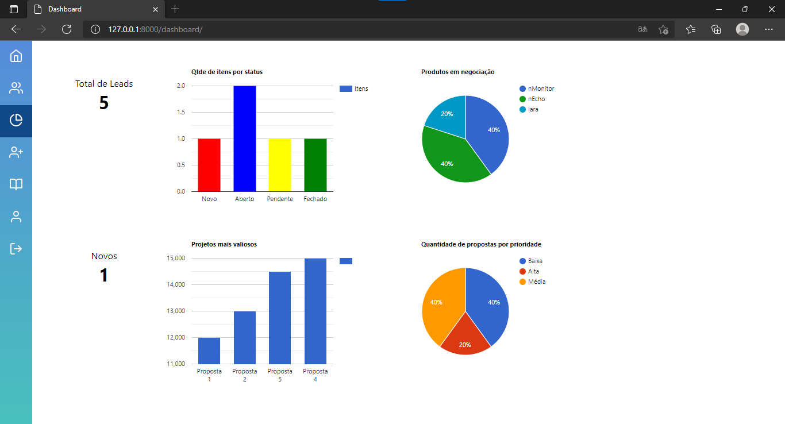
<figcaption style="font-size: smaller;">Tela de dashboard

<h3><b> Tecnologias utilizadas </b></h3>

- <b>Flask: </b> Framework baseado em python, no qual foi desenvolvido o back-end.
- <b>HTML: </b> Linguagem de marcação utilizada para estruturar as páginas.
- <b>CSS: </b> Linguagem utilizada para a estilização do sistema.
- <b>JavaScript: </b> Através do JavaScript foram criadas as funções responsáveis pelo funcionamento do front-end.
- <b>Charts JS: </b> Foi usado a biblioteca Charts JS para a criação dos gráficos existentes na aplicação.
- <b>Figma: </b> Plataforma na qual foi gerado o wireframe do sistema.

<h3><b> Contribuições pessoais </b></h3>

Nesse projeto busquei entender de forma mais aprofundada as tecnologias utilizadas no front-end, codificando a parte visual sem a ajuda do Bootstrap 
- Auxílio na criação e estilização das páginas
  - Nesse projeto, tive uma quantidade maior de telas a serem produzidas, contando com a homepage (continha um kanban para visualização das tasks), tela de contatos, dashboard, cadastro de usuários, relatórios, perfil do usuário e login.
- Auxílio no tratamento dos dados e padronização com python
  - Com o conhecimento aprendido no semestre anterior, o python também foi muito útil para a padronização dos dados fornecidos e que seriam utilizados em nosso sistema.
- Registro dos dados e criação dos gráficos interativos
  - Através do JavaScript, unido também ao backend, criei funções de criação de usuários e tickets no kanban que impactavam diretamente na visualização dos gráficos na tela de dashboard.

<h3 align="center"><b> APRENDIZADOS EFETIVOS </b></h3>

<h3>Hard Skills</h3>

<h4><b> HTML, CSS ★★★★☆</b></h4>

Diferente dos outros semestres, dessa vez não foi utilizado o bootstrap. Como já estava no terceiro semestre e possuia um conhecimento maior das tecnologias, decidi me dedicar para entender de forma mais aprofundada sobre as tags HTML e os atributos do CSS. No início foi um pouco complicado, mas ao longo do desenvolvimento, senti mais facilidade e descobri que conseguiria ter um controle muito maior do meu sistema e do seu visual, ao fazer a estilização sem a ajuda de um framework, me aproximando muito mais do nosso wireframe produzido no Figma. 

<h4><b> JavaScript e Charts JS ★★★☆☆</b></h4>

Devido a experiência anterior com ambas as tecnologias, durante o desenvolvimento desse projeto, consegue trabalhar de forma muito mais fácil, tanto com o JavaScript, para criar as funções necessárias, quanto com o Charts JS, para a geração dos gráficos.

<h4>Front-end ★★★★☆</h4>
Como meu foco maior nesse semestre foi entender de forma mais aprofundada o funcionamento das linguagens utilizadas no frontend, pude compreender melhor o funcionamento, para que serve e em qual momento deveria utilizá-las. O entendimento dos atributos CSS foi o que mais impactou minha forma de desenvolver, pois a partir daí comecei a ser capaz de entregar como resultado, aquilo que estava planejado em nosso wireframe. Esse conhecimento foi muito útil não só para o projeto, mas também me possibilitou consequir um emprego na área, ao final do semestre, como desenvolvedor front-end em uma empresa multi-nacional, a Johnson & Johnson.

<h3>Soft Skills</h3>

<h4>Gestão de pessoas ★★★★☆</h4>
Como já tinha um conhecimento mais elevado do frontend, me encarreguei de organizar os outros desenvolvedores do time que atuariam no frontend, passando algumas tasks que faziam sentido em cada momento, tirando também dúvidas e servindo de apoio para cada um deles, quando necessário

---
---

<h2 id="projeto4" align="center"><b><a href="https://github.com/PhatomFatec/API_SUBITER" style="color: inherit; cursor: pointer;">Projeto 4: Subiter</a> 🔗</b></h2>

Projeto Integrador - 4° Semestre | Fatec Prof. Jessen Vidal - 2021 | Cliente parceiro: Subiter

<h3><b> Visão do Projeto </b></h3>

Este projeto teve como proposta o desenvolvimento de sistema no qual o usuário pudesse abrir chamados para a empresa, de acordo com a disponibilidade dos funcionários e dos equipamentos.

IMAGENS DO SISTEMA

<figcaption style="font-size: smaller;">Homepage

<figcaption style="font-size: smaller;">Tela de contatos

<figcaption style="font-size: smaller;">Tela de dashboard

<h3><b> Tecnologias utilizadas </b></h3>

- <b>Vue JS:</b> Framework no qual foram construidas as páginas e os componentes do sistema.
- <b>Sass:</b> Biblioteca CSS utilizada para facilitar a escrita e organização dos estilos das páginas e de seus componentes.
- <b>Figma:</b> Plataforma utilizada para elaboração do wireframe.
- <b>Spring Boot:</b> Utilizado para o desenvolvimento do back-end.

<h3><b> Contribuições pessoais </b></h3>

<h4><b> Scrum Master </b></h4>

Fiz a organização das demandas do projeto, trabalhando jundo ao Product Owner para priorizar as atividades principais, de forma que pudessemos entregar o MVP ao final de cada sprint, atualizando também o burndown, para fornecer aos demais integrantes do grupo, uma visualização do nosso desenvolvimento.

<h4><b> Desenvolvedor </b></h4>

Trabalhei no desenvolvimento das páginas que constituiam o sistema, a configuração das rotas, toda a estilização e as funções de interatividade do usuário.

<h3 align="center">APRENDIZADOS EFETIVOS</h3>

<h3><b> Hard Skills </b></h3>

<h3><b> Vue JS ★★★★☆ </b></h3>

Utilizei o Vue JS para a criação das páginas do sistema, assim também como cada componente utilizado. Através do framework, fiz a configuração das rotas e a implementação das funcionalidades, através das quais o usuário iria interagir com a aplicação. Fiz também as requisições necessárias para que todo o conteúdo fosse dinâmico.

<h3><b> Sass ★★★★★ </b></h3>

Utilizei a biblioteca Sass do CSS para criar de forma mais fácil e organizada os estilos necessários para dar vida ao sistema. Através dela, pude escrever o código CSS em formato de cascata, que depois era compilado e gerava o CSS em seu formato padrão. O benefício do uso dessa tecnologia foi a escrita de um código mais enxuto e com uma manutenção mais simples.

<h3>Adaptação ★★★★☆</h3>
Utilizar uma tecnologia nova como o Vue JS foi complexo no começo, pois em muitos momentos eu tentava utilizar a sintaxe do Java Script Vanilla de forma automática. Precisei aos poucos adaptar meu modo de pensar e de estruturar os códigos, e ao final consegui um bom resultado e um aprendizado muito grande com o framework, que funcionou muito bem para a proposta da nossa aplicação

<h3>Frameworks ★★★★☆</h3>
Por ser a primeira vez em que tive contato com um framework front-end, foi bem complexo me adaptar ao modo de criação com a nova tecnologia. Mas consegui entender bem o propósito e como deveria utilizá-lo, aplicando também algumas boas práticas à estrutura do sistema.

<h3>Organização ★★★☆☆</h3>
Por estar no cargo de scrum master e de desenvolvedor, precisei organizar melhor tanto minhas atividades quanto a do resto da equipe, o que foi um desafio muito grande mas que consegui superar ao longo das sprints.

---

<h2 id="projeto5" align="center"><b><a href="https://github.com/PhatomFatec/Midall-DataTransfer" style="color: inherit; cursor: pointer;">Projeto 5: Data Transfer</a> 🔗</b></h2>

Projeto Integrador - 6° Semestre | Fatec Prof. Jessen Vidal - 2023 | Cliente parceiro: Visiona

<h3><b> Visão do Projeto </b></h3>

Este projeto teve como objetivo a criação de um sistema de transferência de arquivos, possibilitando o envio tanto do Google Drive para o EC2 da Amazon, quanto o contrário.

IMAGENS DO SISTEMA

<figcaption style="font-size: smaller;">Login

<figcaption style="font-size: smaller;">Cadastro

<figcaption style="font-size: smaller;">Homepage

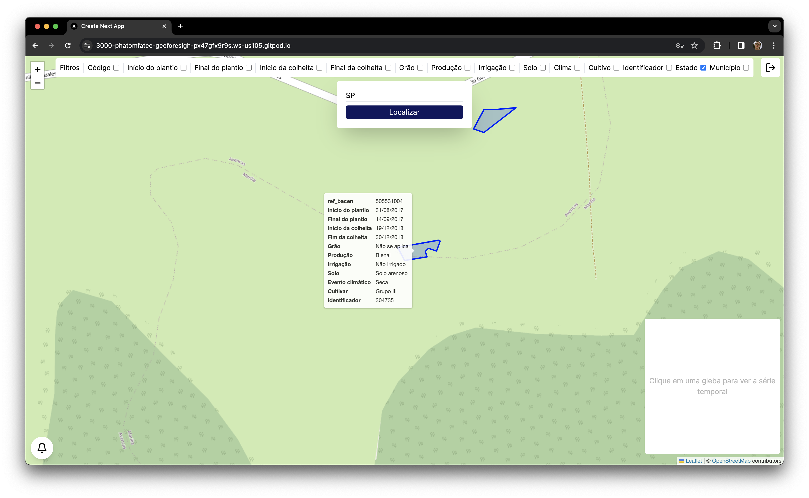
<figcaption style="font-size: smaller;">Homepage

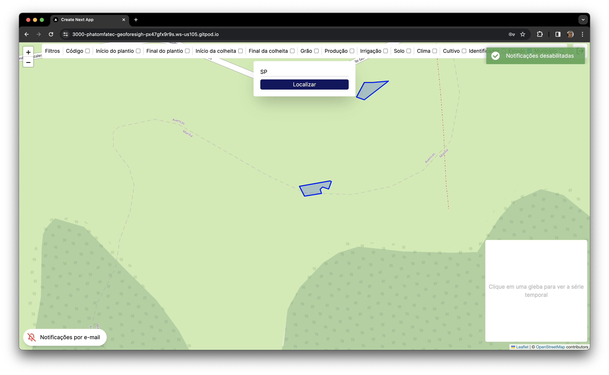
<figcaption style="font-size: smaller;">Homepage

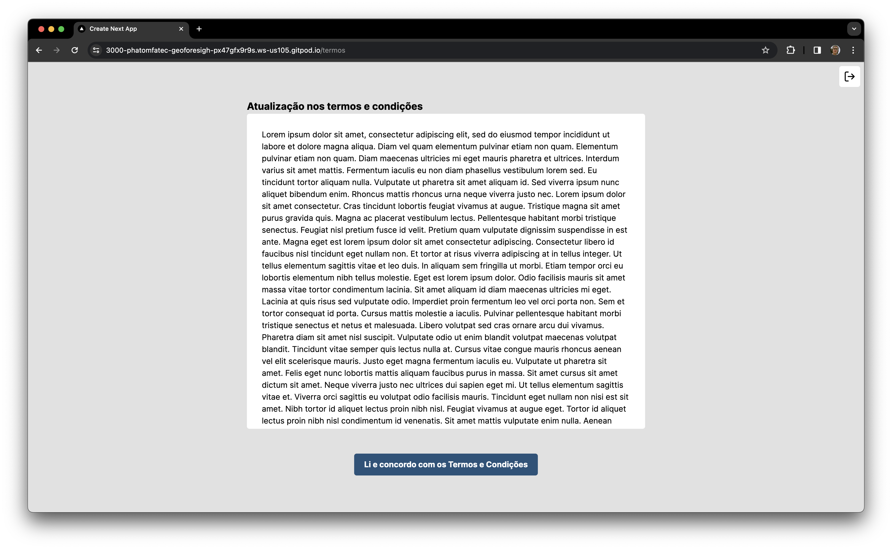
<figcaption style="font-size: smaller;">Atualização dos termos

<h3><b> Tecnologias utilizadas </b></h3>

- <b>HTML:</b> Criação da estrutura das páginas e conteúdos.
- <b>CSS:</b> Estilização das páginas e seus respectivos elementos.
- <b>JavaScript:</b> Utilizado para dar dinamicidade ao sistema, através de funções e requisições.
- <b>Jest:</b> Utilizado para realizar testes unitários das funções criadas no JavaScript.
- <b>Bootstrap:</b> Biblioteca utilizada para gerar a tabela de registro de transferência de arquivos realizadas através do sistema.
- <b>Figma:</b> Elaboração do wireframe.
- <b>Spring Boot:</b> Utilizado para o desenvolvimento do back-end.

<h3><b> Contribuições pessoais </b></h3>
Realizei a criação das páginas através do HTML, a estilização com CSS e as funções de interatividade do sistema com JavaScript. Com o Bootstrap gerei uma tabela onde era possível filtrar os dados exibidos, e que se relacionavam às transferências feitas através da aplicação.
Criei também os testes unitários das funções JavaScript, para fornecer um sistema mais seguro e livre de erros.

<h3 align="center">APRENDIZADOS EFETIVOS</h3>

<h3><b> Hard Skills </b></h3>

<h4><b> JavaScript ★★★★★ </b></h4>

Dessa vez, utilizei o JavaScript de uma forma diferente. Nesse projeto, por não utilizar nenhum framework, fiz uso do JavaScript para manipular os elementos da página e fazer a troca dos mesmos, dependendo da interação do usuário.

<h4><b> Jest ★★★★☆ </b></h4>

Através do Jest criei os testes unitários para as funções do JavaCript, o que por sua vez nos permitiu construir um sistema mais confiável e livre de falhas que poderiam passar despercebidas durante o desenvolvimento.

<h4><b> Bootstrap ★★★☆☆ </b></h4>

Eu havia tido contato com a tecnologia durante os primeiros projetos do API, mas agora, tendo mais conhecimento sobre programação front-end, consegui utilizar melhor esta biblioteca, acompanhando também a documentação como forma de ajuda.

---
---

<h2 id="projeto6" align="center"><b><a href="https://github.com/PhatomFatec/GeoForesight" style="color: inherit; cursor: pointer;">Projeto 6: GeoForesight</a> 🔗</b></h2>

Projeto Integrador - 6° Semestre | Fatec Prof. Jessen Vidal - 2023 | Cliente parceiro: Visiona

<h3><b> Visão do Projeto </b></h3>

Nesse projeto, foi proposto a criação de um sistema capaz de ler e processar informações provenientes de uma API. Essas informações consistem em dados referentes a glebas, que são áreas específicas de terra dedicadas ao plantio e cadastradas no PROAGRO. Devido à natureza sensível dos dados coletados, era fundamental implementar as medidas necessárias da LGPD no sistema.
Em relação aos requisitos da aplicação, foi preciso viabilizar a visualização das glebas em um mapa. Ao passar o cursor sobre uma dessas áreas, o usuário poderia acessar informações detalhadas sobre a respectiva porção de terra. Além disso, ao clicar em uma gleba, o sistema deveria exibir um gráfico de série temporal associado a ela.

IMAGENS DO SISTEMA

<figcaption style="font-size: smaller;">Login

<figcaption style="font-size: smaller;">Cadastro

<figcaption style="font-size: smaller;">Homepage

<figcaption style="font-size: smaller;">Homepage

<figcaption style="font-size: smaller;">Homepage

<figcaption style="font-size: smaller;">Atualização dos termos

<h3><b> Tecnologias utilizadas </b></h3>

- <b>Next JS:</b> O framework baseado em React JS foi utilizado para criação das páginas e componentes de maneira mais facilitada.
- <b>Tailwind:</b> Utilizei o framework CSS para elaboração do design, de forma mais descomplicada e direta, através de classes passadas para cada elemento.
- <b>Leaflet</b>: Biblioteca do React JS que possibilitou a geração do mapa interativo dentro do sistema.
- <b>REGEX</b>: Expressão utilizada para validar os campos de nome, e-mail e senha durante o cadastro do usuário.
- <b>Figma:</b> Utilizado para a elaboração dos wireframes.
- <b>Flask:</b> Framework baseado em python, utilizado para a criação do back-end.
- <b>Mongo DB:</b> Bqnco de dados não relacional utilizado na aplicação.

<h3><b> Contribuições pessoais </b></h3>

<h4><b> Product Owner </b></h4>
    Como PO, mantive contato com a empresa, para entender qual era a sua real necessidade. Entendi que muitas vezes o cliente sabe o que quer, mas não sabe o que precisa, então o meu trabalho foi descobrir a raiz de seu problema e fornecer a solução mais adequada.

<h4><b> Desenvolvedor </b></h4>
    Desenvolvi todo o front-end da aplicação, contendo página de login, cadastro, atualização dos termos, página principal e perfil do usuário, assim também como os componentes necessários para a composição de cada uma. 
    Crei todas as requisições necessárias para a comunicação do front-end com o back-end e as funções que possibilitariam a interação do usuário, como cadastro, login, aceitação de termos, pesquisa filtrada das glebas e visualização do gráfico da série temporal.

<h3 align="center">APRENDIZADOS EFETIVOS</h3>

<h3><b> Hard Skills </b></h3>

<h4><b> Next JS ★★★★☆ </b></h4>

Seguindo no aprendizado de novas tecnologias front-end, decidi me arriscar utilizando NextJS, um framework baseado em ReactJS com algumas melhorias tanto de usabilidade quanto performance. Um dos benefícios do NextJS, e o mais importante para o sistema desenvolvido, foi o funcionamento do fetch, que no JavaScript Vanilla acaba sendo muito básico e sem muitos benefícios se comparado ao Axios, por exemplo, mas que nesse Framework possui um funcionamento diferenciado, como o caching de requisições. O NextJS consegue compreender quando duas requisições iguais são realizadas, e utiliza o processamento em caching para melhorar a performance do sistema, o que gerou uma melhoria significativa.

<h4><b> Leaflet ★★★★☆ </b></h4>

Para a disponibilização de um mapa informativo, utilizei a biblioteca React Leaflet, que já conta com várias funcionalidades importantes e que faziam parte dos requisitos. Com ela consegui criar a área do mapa interativo, onde o usuário poderia utilizar o zoom-in e zoom-out, além de poder navegar por diferentes áreas do mapa. Através dessa biblioteca, também consegui fazer a plotagem das glebas contendo um tooltip com as informações referentes àquela área em especifico por meio de uma requisição para o back-end, na qual recebia tanto os dados informativos, quanto os pontos dos vértices do terreno, para delimitação do mesmo. 

<h4><b> REGEX ★★★★★ </b></h4>

Para a tela de cadastro, fiz o tratamento das informações fornecidas utilizando expressões regex:

- No campo "Nome", o usuário é capaz de inserir apenas letras, não sendo possível adicionar números ou caracteres especiais no campo em questão.
- Ao fornecer o "E-mail", o usuário deve respeitar o formato padrão, contendo a primera parte do email, o caractere especial "@", a segunda parte do email, um ponto "." e três letras finais. Se não cumprida essas exigencias, o campo recebe um destaque em vermelho, esperando que o usuário digite um endereço de e-mail válido.
- O campo de "Senha" também possui alguns requisitos. É preciso inserir ao menos uma letra maiúscula, um caractere numérico, possuir ao menos 8 caracteres no total e reinserir a mesma senha corretamente no campo de validação, para garantir que o usuário sabe a senha que digitou anteriormente, e não inseriu qualquer coisa sem atenção.
- O campo de aceite dos Termos e Condições do sistema também é obrigatório.
- Ainda há também um campo opcional para caso o usuário deseje receber e-mails informativos da plataforma.

Somente depois de fornecer todos os dados corretamente e aceitar os Termos e Condições, que o botão de registro é liberado para o usuário e o cadastro é realizado.

<h4><b> Tailwind ★★★★★ </b></h4>

Com relação à estilização do sistema, ao criar o projeto com NextJS já inseri o Tailwind, um framwork CSS semelhante ao Bootstrap, mas com muito mais liberdade e compatibilidade, através da qual foi possível criar toda a estilização do sistema apenas fornecendo classes nos elementos. Foi uma proposta bem diferente do que eu estava acostumado e um pouco confuso no começo, mas pouco tempo depois as classes já viraram um costume e todo o processo se tornou muito mais fácil. Por conta desse formato diferente, no qual as classes eram inseridas diretamente nos elementos, o maior problema que tive em outros projetos não aconteceu aqui, o conflito de estilos. Em projetos anteriores, quando a estilização chegava em um estágio mais complexo, alguns estilos acabavam conflitando, tornando mais difícil criar algo específico para uma determinada região, o que não aconteceu dessa vez.

<h3><b> Soft Skills </b></h3>

<h4>Empatia ★★★★★</h4>
  Como Product Owner do projeto, precisei entender a dor do cliente, qual era a raíz do problema e o que ele realmente precisava. Me colocando também no lugar dos desenvolvedores quando precisava explicar o que deveríamos fazer, de modo que todos entendessem de uma única forma.

<h4>Liderança ★★★★☆</h4>
  Em momentos de conflitos de ideias quanto a prioridade das entregas, precisei ser firme e claro ao definir quais eram nossos objetivos, para que ao final da sprint pudessemos entregar o MVP.