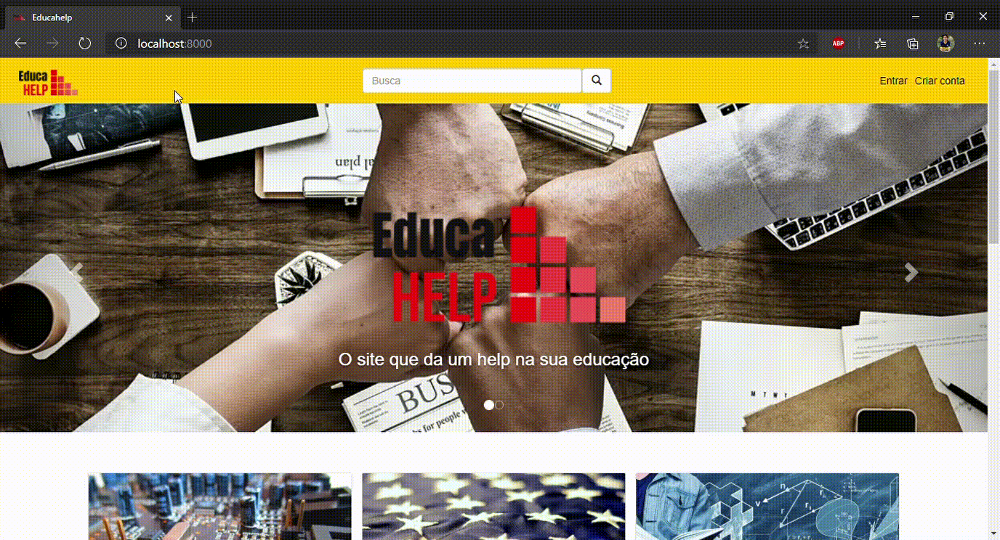

<h1>Marcus Vinícius Augusto Rocha</h1>
<h2> Introdução </h2>

Olá! Eu sou o Marcus Vinícius, e seja bem-vindo ao meu portifólio!

<h3> Principais Conhecimentos </h3>

<b>JavaScript</b>

Em 2020 tive meu primeiro contato com a linguagem, através da necessiade gerada durante a execução do primeiro projeto de API na FATEC.
A cada semestre, foquei em melhorar minhas habilidades com o front-end, o que me permitiu conquistar um trabalho nessa área e me desenvolver cada vez mais.
Hoje também possuo conhecimento em alguns frameworks como Bootstrap, Vue JS e React JS.

---
---

<h2>Sumário</h2>
<h3><a href="#user-content-projeto-1-e-commerce-" style="color: white;"><b>Projeto 1: E-commerce</b></a></h3>
<a href="#user-content-projeto-1-e-commerce-"><h3><b>Projeto 2: Dashboard</b></h3></a>
<a href="#Projeto3"><h3><b>Projeto 3: CRM</b></h3></a>
<a href="#Projeto4"><h3><b>Projeto 4: </b></h3></a>
<a href="#Projeto5"><h3><b>Projeto 5: Data Transfer</b></h3></a>
<a href="#Projeto6"><h3><b>Projeto 6: </b></h3></a>

---
---

<h2 id="#projeto-1-e-commerce" style="text-align: center;"><b><a href="https://github.com/RoyaltyDev/Projeto_integrador_2020-2" target="_blank" style="color: inherit; cursor:pointer;">Projeto 1: E-commerce</a> 🔗</b></h2>

Projeto Integrador - 1° Semestre | Fatec Prof. Jessen Vidal - 2020 | Cliente interno: Profº Antônio Egydio São Thiago Graça

<h3><b> Visão do Projeto </b></h3>

O objetivo do projeto era realizar a criação de um e-commerce para venda de materiais didáticos, também criado pelos alunos, mas com foco em introduzir os alunos ao método ágil utilizando o Scrum e às tecnologias utilizadas durante a criação de um projeto web.

IMAGENS DO SISTEMA

<figcaption style="font-size: smaller;">Homepage

<figcaption style="font-size: smaller;">Parte inferior da homepage - Conteúdos e rodapé

<figcaption style="font-size: smaller;">Página de conteúdo específico

<h3><b> Tecnologias utilizadas </b></h3>

- Python
- Django
- Figma
- HTML
- CSS
- Bootstrap

<h3><b> Python </b></h3>

Sendo a primeira linguagem de programação a qual tive contato, Python é uma linguagem super versátil e descomplicada. Utilizamos o framework Django para compor as páginas do nosso projeto e realizar a integração do back-end com o front-end. Através do uso dessa tecnologia, foi mais fácil configurar as funções e as mudanças de páginas

<h3><b> Contribuições pessoais </b></h3>

Iniciei o projeto focado na parte do front-end, onde participei ativamente na elaboração do design no figma e da criação das telas através de:
- Estruturação das páginas com HTML
- Estilização do sistema com CSS e Bootstrap

<h3><b> Aprendizados Efetivos </b></h3>

Durante o trabalho nesse projeto, pude me desenvolver em algumas áreas na qual nunca havia tido contato anteriormente:

Metodologia Ágil

O início do trabalho com o método Scrum facilitou a organização e desenvolvimento do projeto. Através dele, foi mais fácil compreender quais eram os requisitos e traçar o plano de como iríamos entregá-los

Linguagem de Marcação

Logo no início do projeto tive meu primeiro contato com o HTML, e compreendi que haviam outros tipos de linguagem, além das de programação. Utilizando-o para estruturar nossas páginas, busquei saber mais sobre como a linguagem funcionava, como deveria ser estruturada, o que era indispensável e quais tags deveria utilizar para cada coisa.

Linguagem de Estilização

Em conjunto com o HTML, busquei conhecimento também sobre o CSS, utilizado para dar vida ao sistema e comodidade ao usuário. Entendi que um sistema limpo dá mais conforto ao usuário e o mantém por mais tempo utilizando nosso sistema

Frameworks

O Bootstrap foi o principal framework utilizado por mim durante o trabalho no projeto. Por não ter nenhum conhecimento prévio de como criar uma página web, o Bootstrap serviu de grande auxílio por possuir designs prontos, que são facilmente acessados por meio de classes no HTML.

---

<h2 id="Projeto2" style="text-align: center;"><b><a href="https://github.com/Time-1-ADS/ProjetoGSW" style="color: inherit; cursor: pointer;">Projeto 2: Dashboard</a> 🔗</b></h2>

Projeto Integrador - 2° Semestre | Fatec Prof. Jessen Vidal - 2021 | Cliente parceiro: GSW

<h3><b> Visão do Projeto </b></h3>

O projeto teve como objetivo, realizar a criação de um dashboard, que consumiria dados de fontes diferentes, sendo elas Jira e Trello, para facilitar a visualização das métricas empresariais

IMAGENS DO SISTEMA

<figcaption style="font-size: smaller;">Homepage

<figcaption style="font-size: smaller;">Tela de colaboradores

<figcaption style="font-size: smaller;">Ranking de tasks fechadas

<h3><b> Tecnologias utilizadas </b></h3>

- Python
- Django
- Figma
- HTML
- CSS
- Bootstrap
- Javascript
- Charts JS

<h3><b> JavaScript </b></h3>

Por estar focado na parte do front-end, fez-se necessário o uso de uma nova linguagem de programação para dar mais interatividade ao sistema e torna-lo mais atrativo ao usuário. Através do JavaScript e com o auxílio da biblioteca Charts JS, gerei gráficos com os valores enviados pelo back-end e que dariam sentido ao nosso sistema, validando nossa entrega.

<h3><b> Contribuições pessoais </b></h3>

Ao longo do projeto auxiliei tanto os desenvolvedores da parte do front-end quanto do back-end:
- Auxílio na criação e estilização das páginas
- Auxílio no tratamento dos dados e padronização com python
- Registro dos dados e criação dos gráficos interativos

<h3><b> Aprendizados Efetivos </b></h3>

Nesse segundo projeto consegui estar em mais contato não só com front-end, mas também com o backend, o que me possibilitou me desenvolver nos seguintes quesitos:

Trabalho em equipe

Atuando nas duas frentes do projeto, sendo o front-end e o back-end, acabei desenvolvendo melhor minha forma de trabalhar em equipe. Ao fornecer auxílio, precisei aprimorar meu lado empático e procurar entender as dificuldades de cada um, para que pudesse ajudar da melhor forma e assim conseguirmos finalizar as tarefas dentro do prazo estipulado

Gestão de tempo

Além de prestar auxílio aos meus colegas também possuia minhas próprias tasks, o que me forçou de modo positivo a gerir melhor meu tempo. Separava horários específicos em que estaria livre para ajudar e que estaria focado no que eu havia me comprometido em entregar.

Bibliotecas

O uso de bibliotecas foi algo novo para mim nesse semestre. Esse tipo de tecnologia ajuda muito pois não precisamos criar tudo do zero. Para cada objetivo existem diversas bibliotecas, as quais precisamos apenas importá-las e seguir a documentação de como usá-las.
A biblioteca utilizada foi o Charts JS para composição dos gráficos interativos, e que eram o foco do nosso projeto.

---
